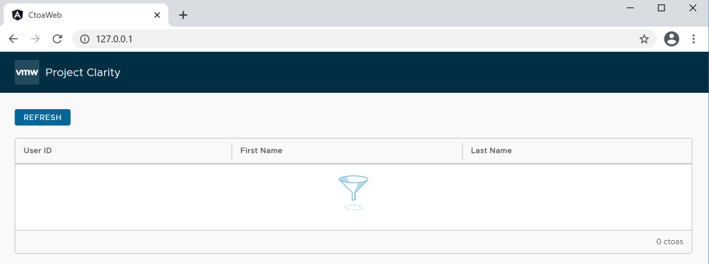
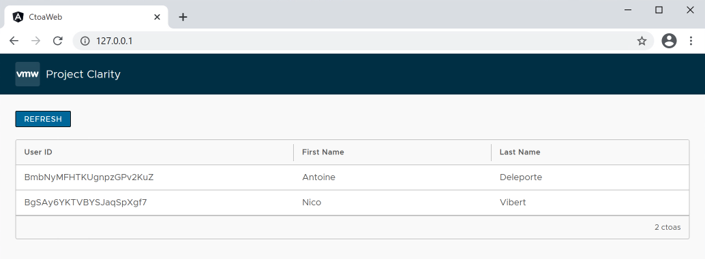

# terraform-build-windows

Instructions and an example of how to build a custom Terraform provider in Windows. Comes with instructions to install a sample web application that Terraform will interact with.

I started writing this as it's sometimes confusing to work out how to compile a Terraform provider in Windows and in which folder to run it.
It's even more confusing when you spend most of your time on a Mac: these instructions are mostly about helping others who run into this challenge.

The walk-through process below will let you compile a custom Terraform provider and interact with a sample web application. 

The provider and application were built by the awesome [Antoine](https://github.com/adeleporte/).

## Assumptions and Format

The format used below assumes your provider is leveraging the following syntax.

Obviously if you want to use your build your own custom Terraform provider, you can replace "vmware.com", "edu" and "ctoa" as per your preference.

For more details, check out the details on the HashiCorp [website](https://www.terraform.io/docs/language/providers/requirements.html).

```hcl
terraform {
  required_providers {
    ctoa = {
      source  = "vmware.com/edu/ctoa"
    }
  }
}
```

## Requirements:

- Git.
- Terraform.
- Go. 

## Usage:

From the Windows command terminal:

Clone the following [repo](https://github.com/adeleporte/ctoa-hacknite.git) with the following command:  
`git clone https://github.com/adeleporte/ctoa-hacknite.git`

Navigate to the Terraform folder:  

`cd ctoa-hacknite\terraform-provider-ctoa`

Create a folder where the compiled provider will be moved to.  
`mkdir -p %APPDATA%\terraform.d\plugins\vmware.com\edu\ctoa\0.1\windows_amd64`

Compile the provider:  

`go build -o terraform-provider-ctoa.exe`

Move the provider to the correct location:  

`move terraform-provider-ctoa.exe %APPDATA%\terraform.d\plugins\vmware.com\edu\ctoa\0.1\windows_amd64`

Assuming you're still in `terraform-provider-ctoa` and in the same folder as the `main.tf` file, the initialization should work:  
`terraform init`

Update the `main.tf` file with more resources. With this Terraform provider, every 'resource' you will create is a user, with a first name and a last name. For example:

```hcl
resource "ctoa_people" "nvibert" {
  first_name = "Nico"
  last_name = "Vibert"
}
```

Before you apply it, we need to start the local webserver. In the `main.tf` file, we refer to the host as the webserver (`127.0.0.1` is the client itself).

To start the webserver, go to the ctoa-web folder:  

`cd .\ctoa-hacknite\frontend\dist\ctoa-web\`

And start the web server:

`.\cto-api.exe` 


  
Don't close the windows above.
 
Go to your browser on 127.0.0.1 and you should see a basic webserver.


 
In your Terraform terminal, once the main.tf file is updated with the resources you are creating, do a:
 
`terraform plan`
 
And a:
 
 `terraform apply`
   
And you should see new entries added to the table on the webserver.



A `terraform destroy` will remove all entries from the table.
